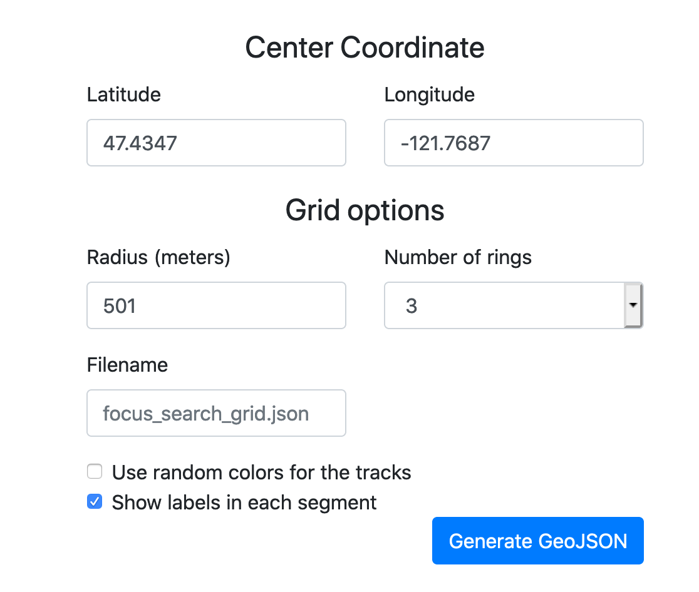
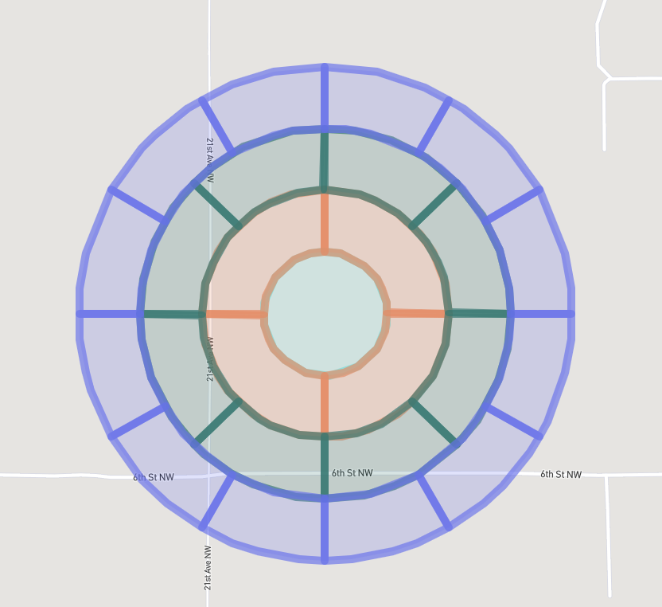

# Focused Search Grid

This repo creates a static website, powering the creation of grid searches in SARTopo

# Installation

1. Make sure you have the latest version of node installed
1. git clone git@github.com:kcesar/focused-search-grid.git
1. npm install
1. npm start
1. Open up a webbrowser to https://localhost:3000

# Hosting the webpage

1. git clone git@github.com:kcesar/focused-search-grid.git
1. npm install
1. npm run prod
1. Copy all of the files in the /dist/ folder to your webserver
